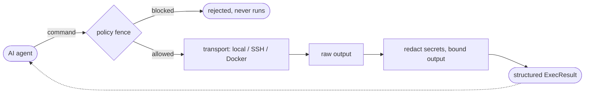

<div align="center">

# execkit

**Stateful, structured, safe command execution for AI agents - over local shells, SSH, and Docker.**

[](https://github.com/blinkingbit-oss/execkit/actions/workflows/ci.yml)
[](https://crates.io/crates/execkit)
[](https://docs.rs/execkit)
[](LICENSE)

</div>

> **Early `0.1.x` release - not production-ready.** See [Limitations](#limitations).

execkit gives an AI agent a **persistent session** on a machine - a local shell, an
SSH host, or a Docker container - and returns a **structured result** for every command. Crucially, it
treats the agent itself as untrusted: every command passes a policy fence, output
is scrubbed of secrets, and flooding output is bounded. Use it as an **embeddable
Rust library** or as an **MCP server** any agent can drive.

## Why

Letting an autonomous agent run shell commands is useful but risky: built-in agent
shells are local-only with no guardrails, managed sandboxes lock you in, and raw
SSH is stateless-per-command with no notion of "is this command allowed?"

**The agent is the adversary.** The LLM driving execkit can be prompt-injected by
anything it reads, so execkit contains its own caller: a command passes the policy
fence *before* it runs, secrets are redacted *before* output returns, and a changed
SSH host key fails loudly instead of reconnecting into a MITM.



## Use it from an agent (MCP)

Install the server - **no Rust toolchain needed**:

```bash
# Prebuilt binary (Linux/macOS, x86_64 + arm64):
curl --proto '=https' --tlsv1.2 -LsSf https://github.com/blinkingbit-oss/execkit/releases/latest/download/execkit-mcp-installer.sh | sh

# ...or with cargo:
cargo install execkit-mcp
```

Point your MCP client at it (`claude mcp add execkit -- execkit-mcp`, or a config block):

```json
{ "mcpServers": { "execkit": { "command": "execkit-mcp" } } }
```

The agent gets three tools - `session_create` (local, ssh, or docker) -> `session_exec` ->
`session_destroy`. `session_exec` returns a structured `ExecResult` (split
stdout/stderr, exit code, cwd), already secret-redacted and bounded.

State persists across calls, and every result is parsed - not scraped from a terminal:

```jsonc
// session_exec {"command": "cd /app && npm ci"}   -> { "exit_code": 0, "cwd": "/app" }
// session_exec {"command": "npm run build"}        // cwd is still /app
//   -> { "stderr": "Error: Cannot find module 'webpack'",
//        "exit_code": 1, "duration_ms": 3420, "cwd": "/app", "truncated": false }
```

See [`crates/execkit-mcp/README.md`](./crates/execkit-mcp/README.md) for the operator
security settings (host-key verification, key dir, audit, session limits).

## Use it as a library

```toml
[dependencies]
execkit = "0.1"                                           # local + SSH + Docker
# execkit = { version = "0.1", default-features = false }  # local + Docker only (no SSH; no russh/tokio)
```

```rust
use execkit::{Policy, Session};

fn main() -> Result<(), execkit::Error> {
    let mut s = Session::local()?
        .with_policy(Policy { allow: vec![], deny: vec!["rm".into()] });

    let r = s.exec("echo hi; echo err 1>&2; cd /tmp")?;
    // r.stdout == "hi"  r.stderr == "err"  r.exit_code == 0  r.cwd == "/tmp"
    println!("{} (exit {})", r.stdout, r.exit_code);
    Ok(())
}
```

Runnable examples: `cargo run --example local`,
`EXECKIT_SSH="user:password@host:22" cargo run --example ssh`, and
`EXECKIT_DOCKER=<container> cargo run --example docker`.

## What you get

- **Persistent, stateful sessions** - `cd`/env/state persist across commands, over
  **local PTY, SSH, or Docker**.
- **Structured `ExecResult`** - split stdout/stderr, exit code, duration, cwd.
- **Safe by construction** - advisory command policy, **secret redaction**, bounded
  (anti-flood) output, SSH host-key verification.
- **One small API, every transport** - the same `ExecResult` regardless of transport.
- **Embeddable, never a service** - `cargo add`, in *your* process; no daemon, no vendor.

## Limitations

An early library - today:

- **Not a sandbox.** The command policy is an *advisory* tripwire (string-matching,
  bypassable). The load-bearing control is a least-privilege *environment* - run the
  agent and SSH user with minimal rights.
- **A timed-out command poisons the session** - you get a clear error and should
  create a new session.
- **Unix-only.** Local sessions need a POSIX shell (`bash`); Windows is later.
- **Synchronous core** - fine for typical agent use; not tuned for thousands of
  concurrent sessions.
- **SSH `AcceptAny` host-key mode** exists for testing, behind an explicit insecure
  opt-in - never use it in production.

Found something rough? [Open an issue](https://github.com/blinkingbit-oss/execkit/issues).

## Contributing & security

- Contributions: see [`CONTRIBUTING.md`](./CONTRIBUTING.md).
- Found a vulnerability? Follow [`SECURITY.md`](./SECURITY.md) - please don't open a
  public issue for security reports.

## License

Apache-2.0 - embed it freely, including commercially. See [`LICENSE`](./LICENSE) and
[`NOTICE`](./NOTICE).
