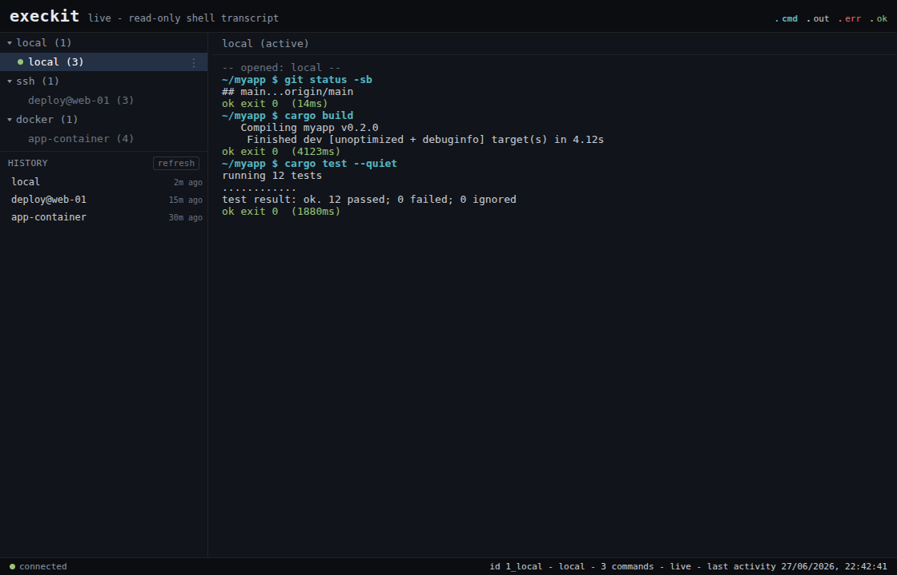
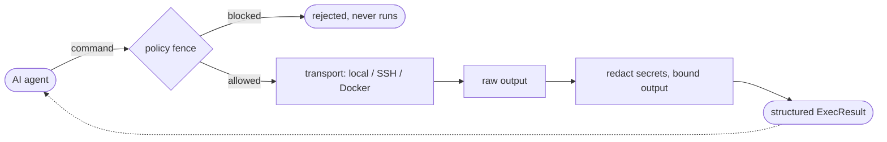
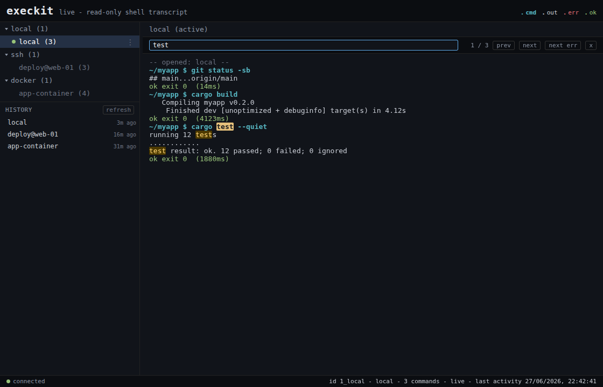
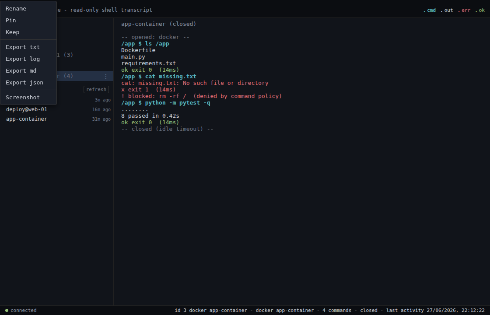

<div align="center">

# execkit

**Persistent, structured shell sessions for AI agents, on your laptop, your servers over SSH, and your Docker containers.**

[](https://github.com/blinkingbit-oss/execkit/actions/workflows/ci.yml)
[](https://crates.io/crates/execkit)
[](https://docs.rs/execkit)
[](https://blinkingbit-oss.github.io/execkit/)
[](LICENSE)



</div>

What you get that a built-in agent shell doesn't:

- **Persistent sessions on local, SSH and Docker.** `cd` and env carry across
  calls, and every command returns a structured result: split stdout/stderr,
  exit code, duration, cwd.
- **Output that protects the agent's context.** Secrets are redacted before the
  model sees them, and output budgets (`tail`, `head`, `grep`, a char cap) keep a
  noisy build from flooding the context window.
- **An audit trail, a live viewer, and undo.** Every command can go to a JSONL
  audit log, you can watch sessions live in a terminal or browser (above), and
  remote sessions can checkpoint and restore the workspace files.

## Install

Zero-install, with [uv](https://docs.astral.sh/uv/). Add this to your MCP client config:

```json
{ "mcpServers": { "execkit": { "command": "uvx", "args": ["execkit-mcp"] } } }
```

Or install it and let execkit print the config for your client:

```bash
pip install execkit-mcp && execkit-mcp setup claude   # or: cursor | gemini | codex | vscode | windsurf
```

Then `execkit-mcp doctor` checks your setup. More options (prebuilt binary,
`cargo install`, building from source) are in the [Quickstart](docs/QUICKSTART.md).

**Status:** early `0.x`. The API may change between minor versions. Read
[Limitations](#limitations) before pointing it at anything important.

## Where it fits

execkit complements your agent's built-in shell or sandbox; it does not replace
it. Use it when the agent needs to work on a remote host or inside a container,
when you want a record of what ran, or when you want to undo file changes on a
remote workspace.

**The agent is the adversary.** The LLM driving execkit can be prompt-injected by
anything it reads, so execkit contains its own caller: a command passes the policy
fence *before* it runs, secrets are redacted *before* output returns, and a changed
SSH host key fails loudly instead of reconnecting into a MITM.


```mermaid
flowchart LR
    A([AI agent]) -->|command| F{policy fence}
    F -->|blocked| X([rejected, never runs])
    F -->|allowed| T[transport: local / SSH / Docker]
    T --> O[raw output]
    O --> R[redact secrets, bound output]
    R --> E([structured ExecResult])
    E -.-> A
```

## Use it from an agent (MCP)

The agent gets `session_create` (local, ssh, or docker), `session_exec`,
`session_list` and `session_destroy`, plus `session_checkpoint` /
`session_checkpoints` / `session_restore` for remote undo.

State persists across calls, and every result is parsed, not scraped from a terminal:

```jsonc
// session_exec {"command": "cd /app && npm ci"}   -> { "exit_code": 0, "cwd": "/app" }
// session_exec {"command": "npm run build"}        // cwd is still /app
//   -> { "stderr": "Error: Cannot find module 'webpack'",
//        "exit_code": 1, "duration_ms": 3420, "cwd": "/app",
//        "truncated": false, "timed_out": false }
```

Commands time out after 120 seconds by default (`timeout_secs` per call, up to
3600). On timeout execkit interrupts the command with Ctrl-C and returns
`timed_out: true` with exit code 124. The session keeps its cwd and env.

See [`crates/execkit-mcp/README.md`](./crates/execkit-mcp/README.md) for the operator
security settings (host-key verification, key dir, audit, session limits).

## Watch what the agent does

Set `EXECKIT_MCP_AUDIT_DIR` and every session is recorded. `execkit-mcp watch`
shows it live in the terminal, and `execkit-mcp watch --serve --open` opens the
read-only browser viewer shown at the top.

| | |
|---|---|
|  |  |
| Search a transcript with `/` and jump between errors. | Rename, pin or keep a session, export it, or take a screenshot. Blocked commands show inline. |

## Use it as a library

```toml
[dependencies]
execkit = "0.9"                                           # local + SSH + Docker
# execkit = { version = "0.9", default-features = false }  # local + Docker only (no SSH; no russh/tokio)
```

```rust
use std::time::Duration;
use execkit::{Policy, Session};

fn main() -> Result<(), execkit::Error> {
    let mut s = Session::local()?
        .with_policy(Policy { allow: vec![], deny: vec!["rm".into()] })
        .with_timeout(Duration::from_secs(60));

    let r = s.exec("echo hi; echo err 1>&2; cd /tmp")?;
    // r.stdout == "hi"  r.stderr == "err"  r.exit_code == 0  r.cwd == "/tmp"
    println!("{} (exit {})", r.stdout, r.exit_code);

    let r = s.exec_with_timeout("sleep 30", None, Duration::from_secs(1))?;
    // r.timed_out == true  r.exit_code == 124; the session is still usable
    Ok(())
}
```

Runnable examples: `cargo run --example local`,
`EXECKIT_SSH="user:password@host:22" cargo run --example ssh`, and
`EXECKIT_DOCKER=<container> cargo run --example docker`.

### Python

The same sessions from Python. `pip install execkit` (native bindings, no Rust
toolchain needed):

```python
from execkit import Session

with Session.local() as s:
    r = s.exec("echo hi; echo err >&2; cd /tmp")
    print(r.stdout, r.exit_code, r.cwd, r.stderr)   # hi 0 /tmp err
```

See [`crates/execkit-py/README.md`](./crates/execkit-py/README.md).

## What's in the box

- **Persistent, stateful sessions** over **local PTY, SSH, or Docker**. SSH
  accepts host aliases from your `~/.ssh/config`.
- **Structured `ExecResult`**: split stdout/stderr, exit code, duration, cwd,
  `truncated`, `timed_out`.
- **Base64 command framing.** Comments, heredocs, `!`, trailing `&`, syntax
  errors and long commands do not hang the session.
- **Timeouts that keep the session.** A timed-out command is interrupted and the
  session carries on.
- **Secret redaction** of common token shapes (AWS, GitHub, GitLab, Slack, Stripe,
  Google, Anthropic, OpenAI, JWTs, PEM private keys), URL passwords,
  `password=`/`token=`-style pairs, and values the session assigned to
  secret-named variables. The echoed command is redacted too.
- **Output budgets**: `tail`/`head`/`head+tail` by line, a `grep` filter with
  context, and a char cap. Per call or a session default; the result reports what
  was kept.
- **Undo for agent actions** on remote sessions: snapshot the workspace and
  restore files if a command goes wrong (needs `git` on the remote and an
  explicit workspace; files only, not side effects).
- **Audit log and live viewer**, plus live MCP notifications to the client.
- **Embeddable, never a service**: `cargo add`, in *your* process; no daemon, no vendor.

## Upgrading to 0.9

Breaking changes from 0.8. The details are in
[Upgrading to 0.9](https://blinkingbit-oss.github.io/execkit/upgrading.html).

- SSH host keys are pinned in `~/.execkit/known_hosts`, not `~/.ssh/known_hosts`.
  Old pins are not read. The first connection re-pins, or copy them over with
  `mkdir -p ~/.execkit && chmod 700 ~/.execkit` then
  `grep -E '^[^ ]+ SHA256:' ~/.ssh/known_hosts >> ~/.execkit/known_hosts`.
  Old pins were keyed by bare host whatever the port: rewrite a line for a
  non-22 port as `[host]:port`, or a later port-22 connection to that host fails
  as a key mismatch.
- stdin is `/dev/null` for every command, and pagers are set to `cat`.
- The target needs `base64`.
- A timeout returns exit code 124 with `timed_out: true` and keeps the session,
  instead of an error that closed it. `ExecResult` has a new `timed_out` field.
- Session ids look like `a3f9-1_local` instead of `1_local`.
- `SshConfig` has a new `connect_timeout` field (default 15 s). Use
  `SshConfig::new`.

## Limitations

- **Not a sandbox.** The command policy is advisory string matching. It is easy to
  bypass: `deny: ["curl"]` blocks `curl` but not `env curl`, `sudo curl` or
  `sh -c curl`. The real control is a least-privilege *environment*: run the agent
  and SSH user with minimal rights.
- **No interactive input.** stdin is `/dev/null`, so prompts, REPLs and editors do
  not work. Use non-interactive flags (`sudo -n`, `apt-get -y`). Pagers default to
  `cat`, but running `less` or `vim` directly hangs until the timeout and closes
  the session. Shell history is off.
- **Timeouts interrupt, they do not kill everything.** execkit sends Ctrl-C. A
  command that ignores Ctrl-C ends the session. For long jobs, run them in the
  background (`nohup CMD > /tmp/job.log 2>&1 &`) and poll the log.
- **The target needs a POSIX shell and `base64`.** Local sessions use `bash`.
  Windows is not supported.
- **Synchronous core.** Fine for typical agent use; not tuned for thousands of
  concurrent sessions.
- **SSH `AcceptAny` host-key mode** exists for testing, behind an explicit insecure
  opt-in. Never use it in production.

Found something rough? [Open an issue](https://github.com/blinkingbit-oss/execkit/issues).

## Contributing & security

- Contributions: see [`CONTRIBUTING.md`](./CONTRIBUTING.md).
- Found a vulnerability? Follow [`SECURITY.md`](./SECURITY.md). Please don't open a
  public issue for security reports.

## License

Apache-2.0: embed it freely, including commercially. See [`LICENSE`](./LICENSE) and
[`NOTICE`](./NOTICE).
